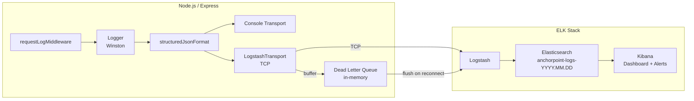

# Design Document: ELK Logging & Analytics

## Overview

This design transitions the AnchorPoint backend from file-based Winston logging to a structured ELK stack pipeline. The existing Winston logger at `backend/src/utils/logger.ts` is refactored to emit ISO 8601 JSON, ship logs to Logstash via TCP, and degrade gracefully when the ELK stack is unavailable. New middleware handles per-request duration logging and route-level sampling. Kibana dashboards and Elasticsearch Watcher alerts are provisioned as exportable configuration artifacts.

The existing OpenTelemetry tracing pipeline (`traceContextFormat`) is preserved unchanged — `traceId` and `spanId` continue to be injected by the existing format and are omitted when no sampled span is active.

## Architecture



Key design decisions:

- **No new logging library**: Winston is extended with a custom transport and format rather than replacing it, minimising blast radius.
- **Transport-level buffering**: The Dead Letter Queue lives inside the custom `LogstashTransport` class, keeping the application logger interface unchanged.
- **Middleware-first request logging**: A new `requestLogMiddleware` attaches to `res.on('finish')` — the same pattern used by the existing `metricsMiddleware` — so request duration logging is decoupled from route handlers.
- **Sampling at middleware layer**: Route sampling is evaluated in `requestLogMiddleware` before the log call, so sampled-out entries never reach Winston at all.

## Components and Interfaces

### 1. `structuredJsonFormat` (Winston format)

Replaces the current `baseFormat` in production and is also applied in all environments (Requirement 1.6).

```typescript
// src/utils/log-format.ts
export function structuredJsonFormat(): winston.Logform.Format;
```

Responsibilities:

- Enforces ISO 8601 timestamp (`new Date().toISOString()`)
- Injects `service` and `environment` from `defaultMeta` / `process.env.NODE_ENV`
- Serialises `Error` objects to `errorMessage` + `errorStack` top-level fields
- Delegates `traceId`/`spanId` injection to the existing `traceContextFormat()` (called before this format in the chain)
- Omits `traceId`/`spanId` when absent (already handled by `traceContextFormat`)

### 2. `LogstashTransport` (Winston transport)

```typescript
// src/utils/logstash.transport.ts
export class LogstashTransport extends winston.Transport {
  constructor(opts: LogstashTransportOptions);
  log(info: LogEntry, callback: () => void): void;
  close(): void;
}

interface LogstashTransportOptions {
  host: string;
  port: number;
  maxBufferSize?: number; // default 1000
  reconnectInterval?: number; // ms, default 5000
}
```

Responsibilities:

- Opens a TCP socket to `LOGSTASH_HOST:LOGSTASH_PORT`
- Writes newline-delimited JSON frames
- Maintains an in-memory circular buffer (Dead Letter Queue) capped at `maxBufferSize`
- On socket error: buffers entries, schedules reconnect, emits console warning when buffer is full
- On reconnect: flushes DLQ in FIFO order before accepting new entries
- All socket I/O is non-blocking; `log()` returns immediately after enqueuing

### 3. `requestLogMiddleware` (Express middleware)

```typescript
// src/api/middleware/request-log.middleware.ts
export function requestLogMiddleware(
  req: Request,
  res: Response,
  next: NextFunction,
): void;
```

Responsibilities:

- Records `Date.now()` at request entry
- Attaches `requestId` to `res.locals` (from `x-request-id` header or `crypto.randomUUID()`)
- On `res.on('finish')`: computes `durationMs`, determines log level by status code, applies sampling, emits structured log entry
- Reads `LOG_SAMPLE_ROUTES` config from `samplingConfig` singleton (see below)

Log level selection:
| Status range | Level |
|---|---|
| 5xx | `error` |
| 4xx | `warn` |
| otherwise | `info` |

### 4. `samplingConfig` (singleton)

```typescript
// src/utils/sampling-config.ts
export interface SamplingConfig {
  getRatio(method: string, route: string): number; // 1.0 = log all
}
export function loadSamplingConfig(): SamplingConfig;
```

Parses `LOG_SAMPLE_ROUTES` JSON at startup. Emits a startup warning on invalid JSON. Returns ratio `1.0` for unmatched routes.

### 5. Logger factory (`src/utils/logger.ts` — refactored)

The existing module is updated to:

1. Always use `structuredJsonFormat` (all environments)
2. Conditionally add `LogstashTransport` when `LOGSTASH_HOST` is set
3. Conditionally add file transports per Requirement 4 rules
4. Emit startup warnings for missing ELK config in production

### 6. Logstash pipeline config (`infra/logstash/pipeline.conf`)

Declarative Logstash configuration (not TypeScript). Handles:

- JSON codec input on the TCP port
- Field type coercions (`level` → keyword, `traceId`/`spanId` → keyword, `timestamp` → date)
- Date-partitioned index output (`anchorpoint-logs-%{+YYYY.MM.dd}`)
- Dead-letter index output on indexing failure (`anchorpoint-logs-dlq`)

### 7. Kibana saved objects (`infra/kibana/dashboard.ndjson`)

Exportable NDJSON file containing:

- Index pattern for `anchorpoint-logs-*`
- Four dashboard panels (error rate, latency percentiles, log volume by level, log table)
- `traceId` field formatter configured as a URL link to `${JAEGER_UI_URL}/trace/{value}`

### 8. Elasticsearch Watcher rules (`infra/elasticsearch/watchers/`)

Two watcher JSON documents:

- `error-rate-watcher.json` — evaluates 5-minute rolling error rate, fires at >5%
- `latency-watcher.json` — evaluates p99 latency, fires at >2000ms (warning) and >5000ms (critical)

Both watchers support webhook and email actions driven by environment variables.

## Data Models

### Log Entry Schema

Every log entry emitted by the logger conforms to this shape:

```typescript
interface LogEntry {
  // Always present
  timestamp: string; // ISO 8601, e.g. "2024-01-15T10:30:00.000Z"
  level: "error" | "warn" | "info" | "debug";
  message: string;
  service: string; // "anchorpoint-backend"
  environment: string; // process.env.NODE_ENV

  // Present when inside an active sampled OTel span
  traceId?: string; // 32-char hex
  spanId?: string; // 16-char hex

  // Present within an HTTP request context
  requestId?: string; // UUID or x-request-id header value
  httpMethod?: string; // "GET", "POST", etc.
  httpRoute?: string; // Express route pattern, e.g. "/api/users/:id"
  httpStatusCode?: number;

  // Present on request completion log entries
  durationMs?: number; // integer milliseconds

  // Present when an Error is logged
  errorMessage?: string;
  errorStack?: string;
}
```

### Dead Letter Queue Entry

```typescript
interface DLQEntry {
  payload: string; // serialised JSON line
  enqueuedAt: number; // Date.now()
}
```

### Sampling Config Shape

```typescript
// Value of LOG_SAMPLE_ROUTES env var
type SampleRoutesConfig = Record<string, number>;
// e.g. { "GET /health": 0.01, "GET /metrics": 0.0 }
```

## Correctness Properties

_A property is a characteristic or behavior that should hold true across all valid executions of a system — essentially, a formal statement about what the system should do. Properties serve as the bridge between human-readable specifications and machine-verifiable correctness guarantees._

### Property 1: Structured log fields are always present

_For any_ log entry emitted by the logger (regardless of environment or call site), the serialised JSON object must contain the fields `timestamp`, `level`, `message`, `service`, and `environment`, and `timestamp` must be a valid ISO 8601 string.

**Validates: Requirements 1.1, 1.6**

---

### Property 2: Trace fields are absent when no active span

_For any_ log entry produced outside an active OpenTelemetry span, the serialised JSON must not contain the keys `traceId` or `spanId` (neither null nor empty string).

**Validates: Requirements 1.2**

---

### Property 3: Error serialisation round trip

_For any_ `Error` object logged by the logger, the serialised JSON must contain `errorMessage` equal to `error.message` and `errorStack` equal to `error.stack`, and must not contain a top-level `error` key.

**Validates: Requirements 1.3**

---

### Property 4: Request log entry contains required HTTP fields

_For any_ completed HTTP request, the emitted log entry must contain `httpMethod`, `httpRoute`, `httpStatusCode`, `durationMs`, and `requestId`.

**Validates: Requirements 1.4, 1.5, 7.1, 7.2**

---

### Property 5: Log level reflects HTTP status code

_For any_ completed HTTP request, the log level of the request completion entry must be `error` when `httpStatusCode >= 500`, `warn` when `httpStatusCode >= 400`, and `info` otherwise.

**Validates: Requirements 7.3, 7.4**

---

### Property 6: Sampling ratio is respected

_For any_ route with a configured sampling ratio `r` (0.0 ≤ r ≤ 1.0), over a large number of requests the fraction of emitted log entries must converge to `r` (within statistical tolerance).

**Validates: Requirements 8.2**

---

### Property 7: Whitespace/invalid sampling config falls back to full logging

_For any_ invalid or absent `LOG_SAMPLE_ROUTES` value, the sampling ratio for all routes must be `1.0` (log everything).

**Validates: Requirements 8.3**

---

### Property 8: DLQ preserves FIFO order on flush

_For any_ sequence of log entries buffered in the Dead Letter Queue, when the connection is restored the entries must be flushed to Logstash in the same order they were enqueued.

**Validates: Requirements 2.4**

---

### Property 9: DLQ capacity cap drops oldest entries

_For any_ Dead Letter Queue at maximum capacity, adding a new entry must drop the oldest entry (index 0) and append the new entry at the tail, keeping the queue size constant.

**Validates: Requirements 2.3, 2.6**

---

### Property 10: File transports absent in production with ELK configured

_For any_ logger instance created with `NODE_ENV=production` and `LOGSTASH_HOST` set, the transport list must not contain any `winston.transports.File` instances.

**Validates: Requirements 4.1**

---

### Property 11: File transports absent outside production

_For any_ logger instance created with `NODE_ENV` not equal to `production`, the transport list must not contain any `winston.transports.File` instances regardless of `LOGSTASH_HOST`.

**Validates: Requirements 4.3**

## Error Handling

| Failure scenario                 | Behaviour                                                                                                                   |
| -------------------------------- | --------------------------------------------------------------------------------------------------------------------------- |
| Logstash unreachable at startup  | `LogstashTransport` catches the connection error, logs a console warning, begins buffering. App starts normally.            |
| Logstash drops mid-flight        | Socket `error` event triggers DLQ buffering and exponential-backoff reconnect. No exception propagates to the request path. |
| DLQ full                         | Oldest entry is evicted. A single `console.warn` is emitted with the drop count. No secondary log entries are produced.     |
| `LOG_SAMPLE_ROUTES` invalid JSON | `loadSamplingConfig` catches the parse error, emits a startup `console.warn`, returns a config that passes all routes.      |
| No alert channels configured     | Logger emits a startup `console.warn` at application boot.                                                                  |
| Elasticsearch indexing failure   | Logstash routes the document to `anchorpoint-logs-dlq` index via dead-letter output plugin.                                 |

The `LogstashTransport.log()` method must never throw synchronously. All errors are caught internally and routed to the DLQ or console.

## Testing Strategy

### Unit Tests

Focus on concrete examples and edge cases:

- `structuredJsonFormat`: verify each mandatory field is present; verify `traceId`/`spanId` absent when no span; verify `Error` serialisation
- `LogstashTransport`: verify DLQ eviction at capacity; verify FIFO flush order; verify no file transport in production+ELK config
- `requestLogMiddleware`: verify `durationMs` is a non-negative integer; verify level selection for 2xx/4xx/5xx
- `samplingConfig`: verify invalid JSON falls back to ratio 1.0; verify exact ratio 0.0 drops all; verify ratio 1.0 keeps all

### Property-Based Tests

Uses **fast-check** (already common in TypeScript ecosystems; install as `fast-check`). Each test runs a minimum of **100 iterations**.

Each test is tagged with a comment in the format:
`// Feature: elk-logging-analytics, Property N: <property text>`

| Property | Test description                 | Generator inputs                                    |
| -------- | -------------------------------- | --------------------------------------------------- |
| P1       | Structured fields always present | Arbitrary `level`, `message`, optional metadata     |
| P2       | Trace fields absent outside span | Log entries produced with no active span            |
| P3       | Error serialisation round trip   | Arbitrary `Error` with random `message` and `stack` |
| P4       | Request log entry fields         | Arbitrary HTTP method, route, status code           |
| P5       | Log level reflects status code   | Arbitrary status codes in 2xx/4xx/5xx ranges        |
| P6       | Sampling ratio convergence       | Arbitrary ratio in [0,1], large N requests          |
| P7       | Invalid sampling config fallback | Arbitrary non-JSON strings and edge values          |
| P8       | DLQ FIFO flush order             | Arbitrary sequences of log entry strings            |
| P9       | DLQ capacity cap                 | Arbitrary entries beyond max capacity               |
| P10      | No file transports in prod+ELK   | Logger instances with various env combinations      |
| P11      | No file transports outside prod  | Logger instances with non-production NODE_ENV       |

Property tests live in `backend/src/utils/__tests__/elk-logging.property.test.ts`.
