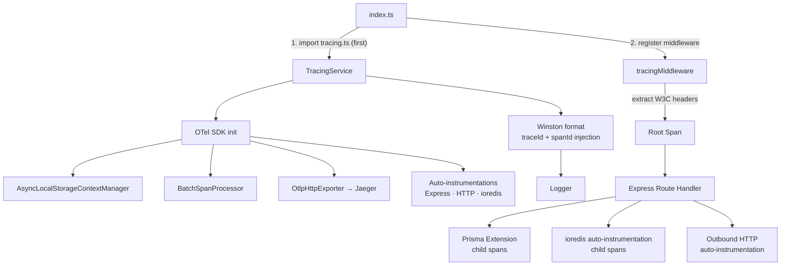

# Design Document: OpenTelemetry Request Tracing

## Overview

This design adds end-to-end distributed request tracing to the AnchorPoint backend using the OpenTelemetry Node.js SDK. Every inbound HTTP request receives a unique trace ID that propagates through async tasks, Prisma database calls, Redis operations, and outbound HTTP calls. Completed spans are exported to Jaeger via OTLP/HTTP. Winston log entries are correlated with active traces by injecting `traceId` and `spanId` fields. The existing Prometheus metrics pipeline is preserved and unaffected.

The implementation follows the OpenTelemetry specification for Node.js, using auto-instrumentation libraries for Express, HTTP, and ioredis, and a Prisma extension for database span creation. The SDK is initialized as the very first import in `backend/src/index.ts` to ensure all instrumentation is active before any middleware or routes are registered.

### Key Design Decisions

- **OTLP/HTTP over OTLP/gRPC**: HTTP is simpler to configure in containerized environments (no HTTP/2 dependency) and is natively supported by Jaeger 1.35+.
- **Auto-instrumentation for Express/HTTP/Redis**: Using `@opentelemetry/instrumentation-express`, `@opentelemetry/instrumentation-http`, and `@opentelemetry/instrumentation-ioredis` avoids manual wrapping of every call site.
- **Prisma extension for DB spans**: There is no official stable OpenTelemetry Prisma instrumentation package; a Prisma client extension using `$extends` is the recommended approach and gives full control over span naming and attribute filtering.
- **AsyncLocalStorageContextManager**: Required for correct context propagation across `async/await` in Node.js. Must be registered before any instrumentation is loaded.
- **No-op mode**: When `OTEL_ENABLED=false`, all exported utilities return immediately, ensuring zero overhead and no SDK initialization.

---

## Architecture



The initialization sequence is critical:

1. `tracing.ts` is imported first in `index.ts` — SDK starts, context manager registered, instrumentations patched.
2. Express app is created and `tracingMiddleware` is registered before all other middleware.
3. All subsequent imports (Prisma client, ioredis, route handlers) are already patched by the auto-instrumentation.

---

## Components and Interfaces

### TracingService (`src/tracing/tracing.service.ts`)

Singleton responsible for SDK lifecycle and utility functions.

```typescript
interface TracingService {
  // Lifecycle
  initialize(): void;
  shutdown(): Promise<void>;

  // Span utilities
  startSpan(name: string, attributes?: SpanAttributes): Span;
  withSpan<T>(name: string, fn: () => Promise<T>): Promise<T>;
  getActiveTraceId(): string | undefined;
  runWithContext<T>(ctx: Context, fn: () => T): T;
}
```

When `OTEL_ENABLED=false`, `initialize()` is a no-op and all utility functions return immediately (no-op Span, `undefined`, or pass-through).

### Tracing Middleware (`src/tracing/tracing.middleware.ts`)

Express middleware that creates the root span for each request.

```typescript
function tracingMiddleware(
  req: Request,
  res: Response,
  next: NextFunction,
): void;
```

Responsibilities:

- Extract W3C `traceparent`/`tracestate` headers via `propagation.extract`.
- Start a root span named `HTTP <METHOD> <route_pattern>`.
- Set standard HTTP semantic convention attributes.
- On `res.finish`: record `http.status_code`, set span status, end span.
- Inject `x-trace-id` and `x-span-id` response headers.

### Prisma Tracing Extension (`src/tracing/prisma.extension.ts`)

A Prisma client extension using `$extends` that wraps every query operation in a child span.

```typescript
function withTracingExtension(prisma: PrismaClient): PrismaClient;
```

- Span name: `prisma:<Model>.<operation>` (e.g., `prisma:User.findMany`)
- Attributes: `db.system=postgresql`, `db.operation`, `db.sql.table`
- No raw SQL parameters recorded.
- On error: set span status `ERROR`, record error event, re-throw.

### Winston Trace Format (`src/tracing/winston-trace.format.ts`)

A custom Winston format that reads the active OTel context and injects `traceId`/`spanId`.

```typescript
function traceContextFormat(): winston.Logform.Format;
```

- Uses `trace.getActiveSpan()` to read the current span context.
- Injects fields only when a valid, sampled span is active.
- Omits fields entirely (not null/empty) when no span is active.

### No-op Implementation (`src/tracing/noop.ts`)

Exported when `OTEL_ENABLED=false`. Implements the same interface as `TracingService` with all methods as no-ops.

---

## Data Models

### Environment Configuration

| Variable                      | Default                           | Description                           |
| ----------------------------- | --------------------------------- | ------------------------------------- |
| `OTEL_ENABLED`                | `true`                            | Set to `false` to disable all tracing |
| `OTEL_SERVICE_NAME`           | `anchorpoint-backend`             | Service name in traces                |
| `OTEL_SERVICE_VERSION`        | `1.0.0`                           | Service version in traces             |
| `OTEL_EXPORTER_OTLP_ENDPOINT` | `http://localhost:4318/v1/traces` | OTLP/HTTP endpoint                    |
| `OTEL_TRACES_SAMPLER_ARG`     | `1.0`                             | Sampling ratio `[0.0, 1.0]`           |

### Span Attribute Schema

**HTTP Root Span** (semantic conventions `@opentelemetry/semantic-conventions`):

| Attribute          | Value                                                 |
| ------------------ | ----------------------------------------------------- |
| `http.method`      | `GET`, `POST`, etc.                                   |
| `http.url`         | Full request URL                                      |
| `http.route`       | Express route pattern (e.g., `/api/transactions/:id`) |
| `http.host`        | `req.hostname`                                        |
| `http.scheme`      | `http` or `https`                                     |
| `http.status_code` | Response status code                                  |

**Prisma Span**:

| Attribute      | Value                      |
| -------------- | -------------------------- |
| `db.system`    | `postgresql`               |
| `db.operation` | `findMany`, `create`, etc. |
| `db.sql.table` | Model name (e.g., `User`)  |

**Redis Span** (via ioredis auto-instrumentation):

| Attribute       | Value              |
| --------------- | ------------------ |
| `db.system`     | `redis`            |
| `db.operation`  | `GET`, `SET`, etc. |
| `net.peer.name` | Redis host         |
| `net.peer.port` | Redis port         |

### Log Entry Schema (augmented)

```json
{
  "level": "info",
  "message": "Transaction created",
  "timestamp": "2024-01-15 10:23:45",
  "service": "anchorpoint-backend",
  "traceId": "4bf92f3577b34da6a3ce929d0e0e4736",
  "spanId": "00f067aa0ba902b7"
}
```

Fields `traceId` and `spanId` are omitted entirely when no span is active.

### New File Layout

```
backend/src/tracing/
  tracing.service.ts       # SDK init, utility functions, singleton export
  tracing.middleware.ts    # Express root-span middleware
  prisma.extension.ts      # Prisma $extends tracing wrapper
  winston-trace.format.ts  # Winston format for trace correlation
  noop.ts                  # No-op implementations for OTEL_ENABLED=false
  index.ts                 # Re-exports public API
```

---

## Correctness Properties

_A property is a characteristic or behavior that should hold true across all valid executions of a system — essentially, a formal statement about what the system should do. Properties serve as the bridge between human-readable specifications and machine-verifiable correctness guarantees._

### Property 1: SDK resource attributes reflect environment configuration

_For any_ values of `OTEL_SERVICE_NAME` and `OTEL_SERVICE_VERSION`, after `TracingService.initialize()` is called, the SDK's resource attributes must contain `service.name` equal to the provided name and `service.version` equal to the provided version (or their defaults when the variables are absent).

**Validates: Requirements 1.1, 1.2**

---

### Property 2: HTTP root span has correct name and all required attributes

_For any_ inbound HTTP request with a given method, URL, route pattern, host, and scheme, the root span created by `tracingMiddleware` must have a name matching `HTTP <METHOD> <route_pattern>` and must contain all of: `http.method`, `http.url`, `http.route`, `http.host`, `http.scheme`, and `http.status_code` (set after response).

**Validates: Requirements 2.3, 2.4, 2.5**

---

### Property 3: W3C traceparent header is used as parent context

_For any_ valid W3C `traceparent` header value, the root span created by `tracingMiddleware` must have a parent span context whose trace ID matches the trace ID encoded in the `traceparent` header.

**Validates: Requirements 2.1, 2.2**

---

### Property 4: 5xx responses set span status to ERROR

_For any_ HTTP response with a status code in the range `[500, 599]`, the root span's status must be `ERROR`. For any response with a status code outside that range, the span status must not be `ERROR`.

**Validates: Requirements 2.6, 6.4**

---

### Property 5: Trace and span IDs are injected into response headers

_For any_ HTTP request that produces an active span, the response must contain `x-trace-id` and `x-span-id` headers whose values exactly match the `traceId` and `spanId` of the active span context.

**Validates: Requirements 2.7**

---

### Property 6: Async context propagation preserves parent-child span relationships

_For any_ async operation (Promise, async/await, callback) started within an active span, a child span created inside that operation must have a `parentSpanId` equal to the outer span's `spanId`.

**Validates: Requirements 3.1, 3.2**

---

### Property 7: runWithContext propagates captured context to callbacks

_For any_ captured `Context` object and any callback function, calling `runWithContext(ctx, fn)` must make the active span from `ctx` the current span inside `fn`, so that any child spans created in `fn` are correctly parented.

**Validates: Requirements 3.4**

---

### Property 8: Prisma spans have correct name and required attributes

_For any_ Prisma model name and operation type, the child span created by the Prisma extension must have a name matching `prisma:<Model>.<operation>` and must contain attributes `db.system=postgresql`, `db.operation`, and `db.sql.table`.

**Validates: Requirements 4.1, 4.2**

---

### Property 9: Prisma errors produce ERROR spans with error events

_For any_ Prisma query that throws an error, the corresponding span must have status `ERROR` and must contain a span event recording the error message, and the original error must be re-thrown.

**Validates: Requirements 4.3**

---

### Property 10: Prisma span attributes contain no query parameter values

_For any_ Prisma query with input parameters, none of the span attributes on the resulting span may contain the string representation of those parameter values.

**Validates: Requirements 4.4**

---

### Property 11: Redis spans have correct name and required attributes

_For any_ Redis command executed within an active trace context, the child span must have a name matching `redis <COMMAND>` and must contain attributes `db.system=redis`, `db.operation`, `net.peer.name`, and `net.peer.port`.

**Validates: Requirements 5.1, 5.2**

---

### Property 12: Redis errors produce ERROR spans with error events

_For any_ Redis command that fails, the corresponding span must have status `ERROR` and must contain a span event recording the error message.

**Validates: Requirements 5.3**

---

### Property 13: Redis span attributes contain no key values

_For any_ Redis command with a key argument, none of the span attributes on the resulting span may contain the key string value.

**Validates: Requirements 5.4**

---

### Property 14: Outbound HTTP spans have correct name and attributes, and inject propagation headers

_For any_ outbound HTTP request made within an active trace context, the child span must have a name matching `HTTP <METHOD> <host>`, must contain `http.method`, `http.url`, and `http.status_code`, and the outbound request must carry `traceparent` and `tracestate` headers derived from the active span context.

**Validates: Requirements 6.1, 6.2, 6.3**

---

### Property 15: Log entries within active spans contain traceId and spanId

_For any_ log entry produced by the Winston logger while an active, sampled span exists, the log entry object must contain `traceId` and `spanId` fields whose values match the active span context.

**Validates: Requirements 7.1**

---

### Property 16: Log entries outside active spans omit traceId and spanId

_For any_ log entry produced by the Winston logger when no span is active, the log entry object must not contain `traceId` or `spanId` fields (not null, not empty string — absent entirely).

**Validates: Requirements 7.2**

---

### Property 17: Out-of-range sampling ratio falls back to 1.0 with a warning

_For any_ value of `OTEL_TRACES_SAMPLER_ARG` that is not a float in `[0.0, 1.0]` (e.g., negative, greater than 1, or non-numeric), `TracingService.initialize()` must log a warning and configure the sampler with ratio `1.0`.

**Validates: Requirements 9.3**

---

### Property 18: withSpan ends span and propagates result for any async function

_For any_ async function passed to `withSpan`, the span must be ended exactly once regardless of whether the function resolves or rejects, the resolved value must be returned unchanged, and a rejected error must be re-thrown with the span status set to `ERROR`.

**Validates: Requirements 10.2, 10.3**

---

### Property 19: getActiveTraceId returns trace ID within span, undefined outside

_For any_ active span, `getActiveTraceId()` must return the 32-character hex trace ID string of that span. When called outside any active span, it must return `undefined`.

**Validates: Requirements 10.4**

---

### Property 20: No-op mode — all utility functions are safe to call when tracing is disabled

_For any_ call to `startSpan`, `withSpan`, `getActiveTraceId`, or `runWithContext` when `OTEL_ENABLED=false`, the function must not throw, must not emit any spans, and must return a sensible default (no-op span, pass-through result, or `undefined`).

**Validates: Requirements 11.1, 1.3**

---

## Error Handling

### SDK Initialization Failures

If `NodeSDK.start()` throws (e.g., invalid exporter config, missing dependency), the error is caught, logged via the Winston logger at `error` level, and the application continues with a no-op tracer. This prevents observability infrastructure issues from taking down the application.

### Exporter Connectivity Failures

The `BatchSpanProcessor` handles export failures internally. When the OTLP endpoint is unreachable, the processor retries with exponential backoff. If the span buffer (`maxQueueSize`, default 2048) fills up, the oldest spans are dropped. A warning is logged when drops occur. The request path is never blocked by export retries.

### Prisma Extension Errors

The Prisma extension wraps each query in a try/catch. On error: the span status is set to `ERROR`, the error message is recorded as a span event, the span is ended, and the original error is re-thrown. The extension never swallows errors.

### Sampling Configuration Errors

If `OTEL_TRACES_SAMPLER_ARG` is not a valid float in `[0.0, 1.0]`, a warning is logged and the ratio defaults to `1.0`. This is validated at startup, not per-request.

### Graceful Shutdown

On `SIGTERM` or `SIGINT`, `sdk.shutdown()` is called which flushes the `BatchSpanProcessor` buffer. A timeout of 5 seconds is applied; if the flush does not complete in time, the process exits anyway to avoid hanging.

---

## Testing Strategy

### Dual Testing Approach

Both unit tests and property-based tests are required. Unit tests cover specific examples, integration points, and error conditions. Property-based tests verify universal correctness across all valid inputs.

### Property-Based Testing Library

**Library**: `fast-check` (npm package `fast-check`)

`fast-check` is the standard property-based testing library for TypeScript/JavaScript. It integrates with Jest via `fc.assert(fc.property(...))` and supports arbitrary generators for strings, numbers, objects, and custom types.

Install: `npm install --save-dev fast-check`

Each property test must run a minimum of **100 iterations** (fast-check default is 100; set `numRuns: 100` explicitly).

Each property test must include a comment tag in the format:

```
// Feature: opentelemetry-request-tracing, Property <N>: <property_text>
```

### Unit Tests

Located in `backend/src/tracing/__tests__/`.

Focus areas:

- `TracingService.initialize()` with various env var combinations (examples for 1.3, 1.5, 8.1–8.5, 9.4)
- `tracingMiddleware` with mock `req`/`res` objects for specific status codes
- Prisma extension with a mock Prisma client
- Winston format with mock span contexts
- Graceful shutdown signal handling (8.5)
- No-op mode behavior (11.1)

### Property-Based Tests

Located in `backend/src/tracing/__tests__/properties/`.

| Test File                                | Properties Covered |
| ---------------------------------------- | ------------------ |
| `sdk-config.property.test.ts`            | P1, P17, P20       |
| `http-middleware.property.test.ts`       | P2, P3, P4, P5     |
| `async-propagation.property.test.ts`     | P6, P7             |
| `prisma-extension.property.test.ts`      | P8, P9, P10        |
| `redis-instrumentation.property.test.ts` | P11, P12, P13      |
| `outbound-http.property.test.ts`         | P14                |
| `winston-format.property.test.ts`        | P15, P16           |
| `span-utilities.property.test.ts`        | P18, P19           |

### Test Infrastructure

Property tests use an in-memory `InMemorySpanExporter` from `@opentelemetry/sdk-trace-base` to capture spans without a real Jaeger instance. The exporter is reset between each test run.

```typescript
import {
  InMemorySpanExporter,
  SimpleSpanProcessor,
} from "@opentelemetry/sdk-trace-base";

const exporter = new InMemorySpanExporter();
// Reset between tests: exporter.reset()
// Inspect spans: exporter.getFinishedSpans()
```

For Winston format tests, a custom transport that captures log entries in memory is used instead of console output.
